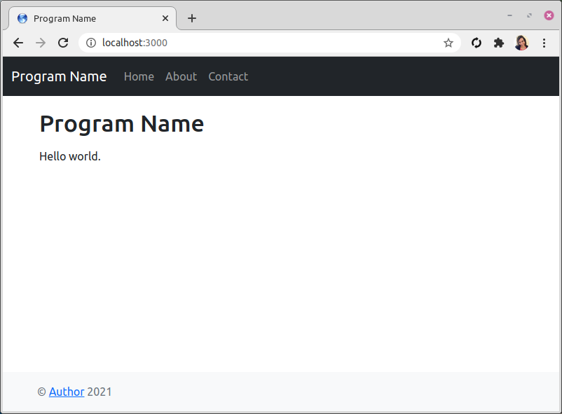

Node.js Bootstrap Starter Template
===

A quick and easy Node.js + [Express](https://expressjs.com) + [Pug](https://www.npmjs.com/package/pug) + Twitter [Bootstrap](https://getbootstrap.com) 5.0 template project.

Also available for [Material](https://github.com/primaryobjects/Node.js-Material-Starter-Template) and [React 4](https://github.com/primaryobjects/Node.js-React-Starter-Template)



## Usage
- Clone repository.
- Open a command prompt, navigate to the folder, and enter: npm install
- Next, run the app by entering: node app
- Browse to http://localhost:3000

## Demo:
http://nodebootstrapper.herokuapp.com

## Contents:

- layout.pug
- header.pug
- footer.pug
- index.pug

## Editing Pages:

Edit views/index.pug to add your content. The default contents include:

```
extends layout

block content
  main.flex-shrink-0
    .container
      h1.mt-5 Program Name
      p.lead
      | Hello world.
```

## Author
Kory Becker http://www.primaryobjects.com/kory-becker
